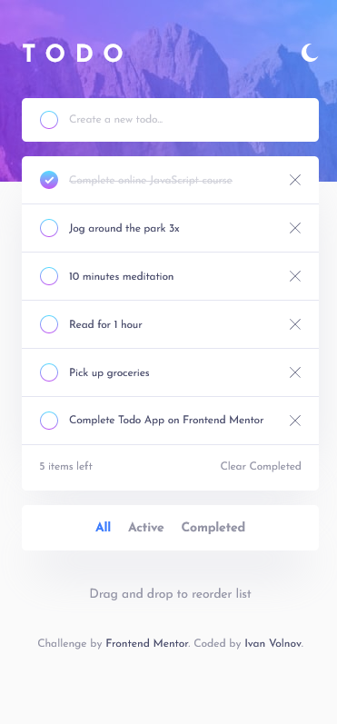
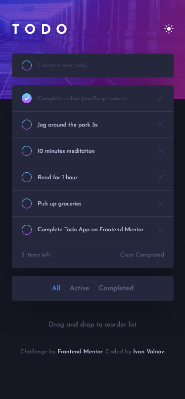

# To-Do App

This is a simple To-Do App built using HTML, CSS, and JavaScript, following a mobile-first approach for responsive design.

This is a solution to the [Todo app challenge on Frontend Mentor](https://www.frontendmentor.io/challenges/todo-app-Su1_KokOW)

## Demo

You can see a live demo of the To-Do App [here](https://todo-app-by-ivan-volnov.netlify.app/).

### Screenshot

## Features

- **Mobile-First Design:** The app is designed with a mobile-first approach for a seamless experience on various screen sizes.
- **Add, Complete, and Delete Tasks:** Easily manage your to-do list.
- **Drag and Drop:** Reorder tasks by dragging and dropping.
- **Filter Options (All, Active, Completed):** Quickly toggle between different task views.
- **Clear Completed:** Remove all completed tasks at once.
- **Data Persistence:** Tasks are saved locally for return visits.
- **Responsive:** Adapts to different screen sizes.

## Technologies Used

- HTML
- CSS
- Vanilla JavaScript
